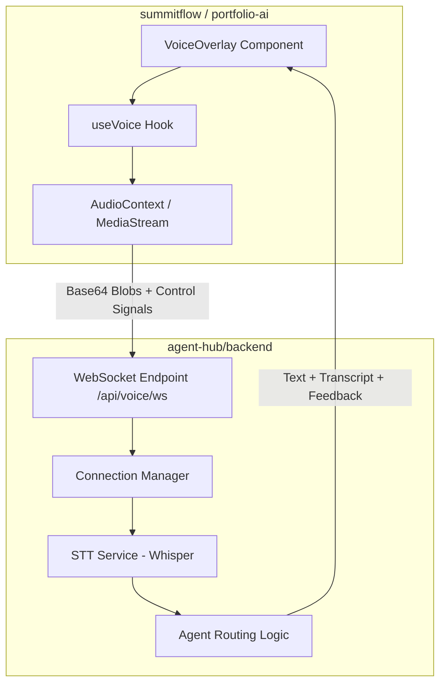

# Voice Architecture: Agent Hub & Passport Client

This document outlines the architecture and integration of the voice-first interface used across SummitFlow and Portfolio AI projects.

## System Overview

The voice system follows a "Thin Client, Heavy Server" model to ensure consistent behavior across multiple frontends while maintaining low-latency processing.

## Core Components

### 1. `@agent-hub/passport-client` (Shared Package)
Located in `agent-hub/packages/passport-client`.
- **`useVoice` Hook**: Manages WebSocket state, audio capture (16kHz Mono), and signaling.
- **`VoiceOverlay` Component**: A standardized, floating UI that provides the microphone interface.
- **Signaling**: Uses `control: start` and `control: stop` messages to coordinate server-side buffering.

### 2. `agent-hub/backend` (Service Layer)
- **FastAPI WebSocket**: Handles high-concurrency real-time connections.
- **Audio Buffering**: Accumulates incoming chunks in memory (pre-transcription) keyed by WebSocket ID.
- **STT (Speech-to-Text)**: Uses `faster-whisper` for efficient CPU/GPU transcription.
- **Context Awareness**: The `app` query parameter (e.g., `?app=summitflow`) allows the backend to route queries to the correct domain logic.

## Bundler & Resolution Logic

We encountered a significant distinction in how modern bundlers handle local package dependencies.

### Current Status
| Project | Next.js Version | Bundler | Resolution |
| :--- | :--- | :--- | :--- |
| **SummitFlow** | v15.x | **Turbopack** | Standard (`transpilePackages`) |
| **Portfolio AI** | v16.x | **Webpack** | Custom Alias + `--webpack` flag |

### The "Outside Root" Problem
In **Next.js 16 (Portfolio AI)**, the Turbopack engine enforces a strict security boundary. It blocks any code imports that live outside the project's root folder (even via symlinks), which prevents it from reading the shared `agent-hub` folder.

**The Fix for Portfolio AI (Webpack Mode):**
We temporarily forced Webpack mode because it allows defining a `resolve.alias` that points directly to the source folder, bypassing the root restriction.

### Potential Future Fix (Turbopack)
To move Portfolio AI back to Turbopack while keeping the shared library, we would need to implement a **Formal Monorepo Workspace**:
1. Create a `pnpm-workspace.yaml` (or equivalent) at the absolute home directory level.
2. Define `summitflow`, `portfolio-ai`, and `agent-hub` as members.
3. This signals to Turbopack that it is part of a larger project and allows cross-package resolution without security errors.

## Testing & Verification
- **Logging**: Check `journalctl --user -u agent-hub-backend` for server-side processing errors.
- **Browser Console**: Look for `Voice Client Connecting to: ...` to verify WebSocket handshakes.
- **Voice Loop**: Expect a Blue bubble (Transcript) followed by a Grey bubble (Agent Response).
